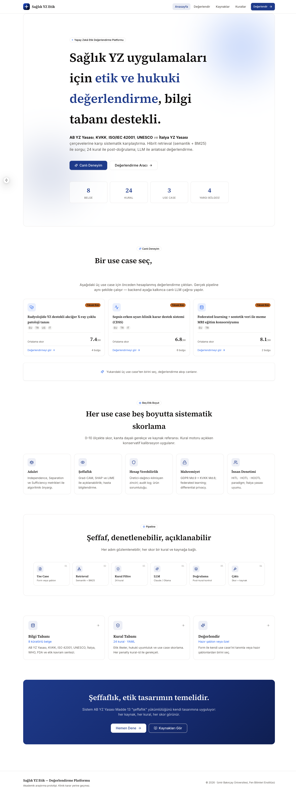
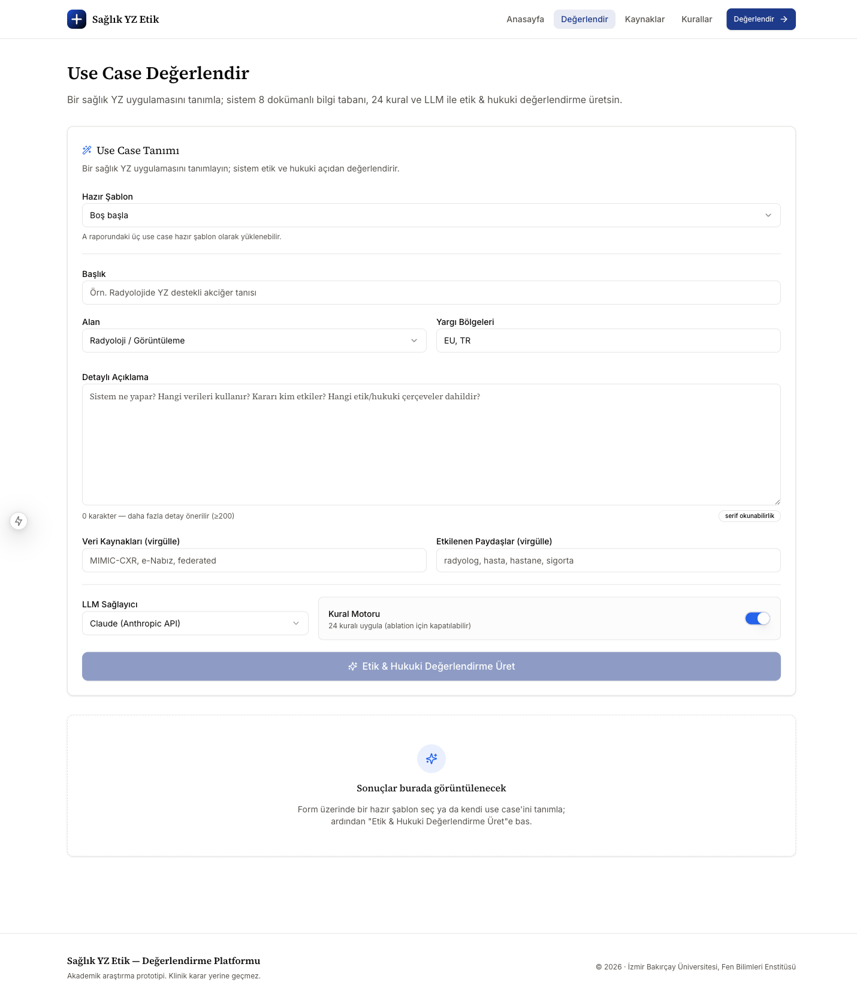
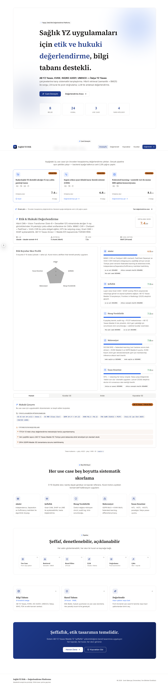
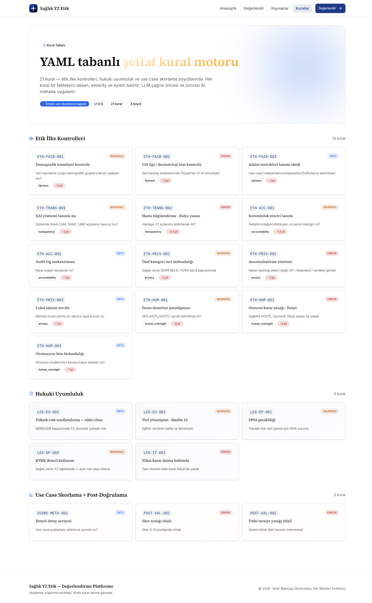
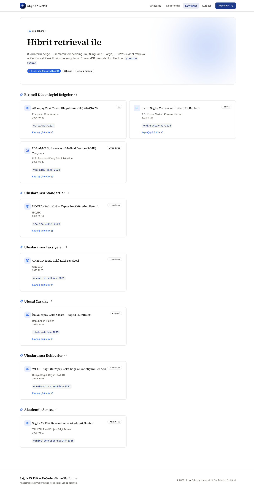
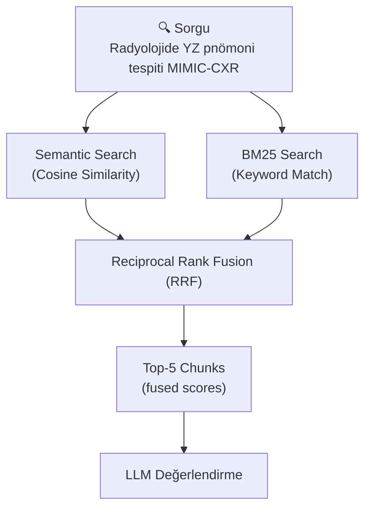

<div align="center">



# ⚕️ EthicGuard

### Sağlık YZ Etik & Hukuki Uyumluluk Değerlendirme Platformu

[](https://www.python.org/)
[](https://fastapi.tiangolo.com/)
[](https://nextjs.org/)
[](https://react.dev/)
[](https://www.trychroma.com/)
[](https://groq.com/)
[](https://www.docker.com/)
[](LICENSE)

**Sağlık alanındaki YZ uygulamalarını 7 uluslararası düzenleyici çerçeveye karşı sistematik biçimde değerlendiren kural tabanlı RAG-LLM platformu.**

[🚀 Hızlı Başlangıç](#-hızlı-başlangıç-docker-ile-kurulum) · [📖 API Docs](http://localhost:8000/docs) · [🎮 Demo](#-kullanım) · [📋 Teknik Rapor](docs/06-TeknikRapor/teknik-rapor.md)

---

> **Akademik Bağlam:** YZM 714 Yapay Zekânın Etik ve Hukuki Boyutu · Seçenek B Final Projesi  
> **Geliştirici:** Elif Duymaz Yılmaz · **Dönem:** 2025–2026 Bahar  
> **Üniversite:** İzmir Bakırçay Üniversitesi — Fen Bilimleri Enstitüsü

</div>

---

## 📋 İçindekiler

1. [Proje Tanımı](#-proje-tanımı)
2. [Ekran Görüntüleri](#-ekran-görüntüleri)
3. [Teknoloji Yığını](#-teknoloji-yığını)
4. [Sistem Mimarisi](#-sistem-mimarisi)
5. [Nasıl Çalışır?](#-nasıl-çalışır)
6. [Hızlı Başlangıç (Docker)](#-hızlı-başlangıç-docker-ile-kurulum)
7. [Manuel Kurulum](#-manuel-kurulum-docker-olmadan)
8. [Kullanım](#-kullanım)
9. [API Referansı](#-api-referansı)
10. [Sorun Giderme](#-sorun-giderme)
11. [Klasör Yapısı](#-klasör-yapısı)

---

## 📖 Proje Tanımı

**EthicGuard**, sağlık alanındaki yapay zekâ uygulamalarını çoklu düzenleyici ve etik çerçevelere karşı sistematik biçimde değerlendiren **kural tabanlı RAG-LLM** (Retrieval-Augmented Generation + Large Language Model) platformudur.

### Değerlendirme Çerçeveleri

| Çerçeve | Açıklama |
|---------|----------|
| **AB YZ Yasası** (EU AI Act 2024/1689) | Risk sınıflandırması, yüksek-risk gereksinimleri |
| **KVKK** + Üretken YZ Rehberi (Kasım 2025) | Türkiye veri koruma, sağlık verisi işleme |
| **ISO/IEC 42001** | YZ Yönetim Sistemi standardı |
| **UNESCO YZ Etiği Tavsiyesi** (2021) | Küresel etik ilkeler |
| **İtalya YZ Yasası** (Ekim 2025) | Sağlık YZ için özel hükümler |
| **WHO Sağlıkta YZ Etiği** | Sağlık sektörü kılavuzları |
| **FDA AI/ML SaMD** | ABD tıbbi cihaz düzenlemeleri |

### Sistem Çıktıları

Her değerlendirme için:

- **5 Etik Boyut Skoru** (0-10): Adalet, Şeffaflık, Hesap Verebilirlik, Mahremiyet, İnsan Denetimi
- **AB YZ Yasası Risk Sınıfı**: Yasak / Yüksek / Sınırlı / Minimal
- **Uygulanabilir Düzenlemeler Listesi**
- **Uyumluluk Boşlukları**
- **Markdown Narratif Değerlendirme**
- **Kaynak Referansları** (retrieval skorları ile)

---

## 🖼 Ekran Görüntüleri

<table>
  <tr>
    <td align="center" width="50%">
      
      <br/>
      <sub><b>Değerlendirme Formu</b> — Use case girişi ve LLM seçimi</sub>
    </td>
    <td align="center" width="50%">
      
      <br/>
      <sub><b>Değerlendirme Sonuçları</b> — 5 boyutlu radar grafiği ve risk sınıfı</sub>
    </td>
  </tr>
  <tr>
    <td align="center" width="50%">
      
      <br/>
      <sub><b>Kural Motoru</b> — 24 deklaratif etik & hukuki kural</sub>
    </td>
    <td align="center" width="50%">
      
      <br/>
      <sub><b>Bilgi Tabanı</b> — 8 küratörlü düzenleyici belge</sub>
    </td>
  </tr>
</table>

---

## 🛠 Teknoloji Yığını

| Katman | Araç / Kütüphane | Sürüm | Açıklama |
|--------|-------------------|-------|----------|
| **Frontend** | [Next.js](https://nextjs.org/) | 15 | React tabanlı, App Router |
| **UI** | [shadcn/ui](https://ui.shadcn.com/) + [Tailwind CSS](https://tailwindcss.com/) | v4 | Bileşen kütüphanesi ve stil |
| **Grafik** | [Recharts](https://recharts.org/) | latest | Radar / skor görselleştirme |
| **Backend** | [FastAPI](https://fastapi.tiangolo.com/) | 0.115+ | Asenkron REST API |
| **Dil** | [Python](https://www.python.org/) | 3.11+ | Backend çalışma zamanı |
| **Vector DB** | [ChromaDB](https://www.trychroma.com/) | latest | Semantik arama ve depolama |
| **Embedding** | [intfloat/multilingual-e5-base](https://huggingface.co/intfloat/multilingual-e5-base) | — | Çok dilli gömme modeli (~400 MB) |
| **LLM (varsayılan)** | [Groq](https://groq.com/) · Llama 3.1 8B | — | Ücretsiz, düşük gecikmeli LLM API |
| **LLM (alternatif)** | [Claude Sonnet](https://www.anthropic.com/) / [Ollama](https://ollama.com/) | — | Bulut veya yerel model seçeneği |
| **Retrieval** | BM25 + Semantic + RRF | — | Hibrit arama füzyonu |
| **Orkestrasyonu** | [Docker Compose](https://docs.docker.com/compose/) | — | Tek komutla çalıştırma |

---

## 🏗 Sistem Mimarisi

```mermaid
flowchart TB
    subgraph FE["🖥️  FRONTEND — Next.js 15 · localhost:3000"]
        direction LR
        P1[Anasayfa / Playground]
        P2[/evaluate — Form ve Sonuç]
        P3[/rules — 24 Kural]
        P4[/sources — 8 Belge]
    end

    subgraph BE["⚙️  BACKEND — FastAPI · localhost:8000"]
        direction TB
        subgraph RAG["RAG Pipeline"]
            R1[1. Query Build] --> R2[2. Hybrid Retrieval]
            R2 --> R3[3. Pre-LLM Rule Check]
            R3 --> R4[4. LLM Generation]
            R4 --> R5[5. Post-LLM Adjust]
            R5 --> R6[6. Format Response]
        end
        DB[(ChromaDB\nVectors)]
        RE[Rule Engine\n24 Kural]
        LLM[LLM Provider\nGroq / Claude / Ollama]
        R2 <--> DB
        R3 <--> RE
        R4 <--> LLM
    end

    FE -->|REST API| BE
    BE -->|JSON Response| FE
```

---

## ⚙ Nasıl Çalışır?

### 1. Bilgi Tabanı (Knowledge Base)

8 küratörlü Markdown belge, sisteme yüklenirken:
- ~350 token'lık chunk'lara bölünür
- Her chunk `multilingual-e5-base` ile embedding'e dönüştürülür
- ChromaDB'de metadata ile birlikte saklanır
- BM25 indeksi oluşturulur

**Sonuç:** 8 belge → 58 chunk

### 2. Kural Motoru (Rule Engine)

24 deklaratif kural, 3 kategoride:

| Kategori | Kural Sayısı | Örnek |
|----------|--------------|-------|
| **Etik İlkeler** | 13 | Demografik temsiliyet, XAI gereksinimi, HITL paradigması |
| **Hukuki Uyumluluk** | 8 | AB YZ Yasası Madde 6, KVKK ikincil kullanım |
| **Skorlama** | 3 | Baz skor, ceza sistemi |

Kurallar:
- **Pre-LLM:** Use case'den tetiklenen kuralları belirler, LLM'e bağlam olarak verir
- **Post-LLM:** LLM skorlarına ceza uygular (örn: MIMIC veri seti → -2.0 fairness)

### 3. Hibrit Retrieval



### 4. LLM Değerlendirme

Groq Cloud üzerinden Llama 3.1 8B:
- Sistem promptu: 5 etik boyut tanımları, JSON şeması
- Kullanıcı promptu: Use case + retrieved chunks + kural bağlamı
- Çıktı: Yapılandırılmış JSON (skorlar, gerekçeler, kaynaklar)

### 5. Post-Processing

- LLM çıktısı JSON olarak parse edilir
- Kural motorundan gelen cezalar uygulanır
- Final skorlar ve metadata eklenir
- Frontend'e JSON response döner

---

## 🚀 Hızlı Başlangıç (Docker ile Kurulum)

**En kolay yöntem.** Docker Desktop yüklüyse, tek komutla çalıştırabilirsiniz.

### Önkoşullar

| Yazılım | Sürüm | Kontrol | İndirme |
|---------|-------|---------|---------|
| **Docker Desktop** | 4.0+ | `docker --version` | https://www.docker.com/products/docker-desktop |
| **Git** *(opsiyonel)* | herhangi | `git --version` | https://git-scm.com/downloads |

### Adım 1: Projeyi İndirin

```bash
# Git ile
git clone <repo-url>
cd ai-ethics-legal-rag

# VEYA zip olarak indirdiyseniz, klasöre girin
cd ai-ethics-legal-rag
```

### Adım 2: Groq API Anahtarı Alın (Ücretsiz, 2 dakika)

1. Tarayıcıda açın: **https://console.groq.com**
2. **Continue with Google** ile giriş yapın (kredi kartı gerekmez)
3. Sol menü → **API Keys** → **Create API Key**
4. İsim verin (örn: `saglik-yz`) → **Submit**
5. Anahtarı kopyalayın: `gsk_...` ile başlar

> ⚠️ Bu sayfa kapanınca anahtar bir daha gösterilmez!

### Adım 3: Yapılandırma Dosyasını Oluşturun

```bash
# Şablonu kopyalayın
cp .env.example .env

# Düzenleyin (nano, vim, VS Code, herhangi bir editör)
nano .env
```

`.env` dosyasında şu satırı bulup anahtarınızı yapıştırın:

```
GROQ_API_KEY=gsk_BURAYA_KENDI_ANAHTARINIZI_YAPIŞTIRIN
```

### Adım 4: Docker Compose ile Başlatın

```bash
docker compose up
```

**İlk çalıştırma süresi:** ~5-10 dakika
- Docker image'ları build edilir
- Python paketleri yüklenir
- Embedding modeli indirilir (~400 MB)
- Bilgi tabanı oluşturulur

**Sonraki çalıştırmalar:** ~30 saniye

### Adım 5: Tarayıcıda Açın

Şu mesajları gördüğünüzde sistem hazırdır:

```
yzm714-backend   | ✓ Bilgi tabanı kuruldu: 8 belge, 58 chunk
yzm714-backend   | INFO: Uvicorn running on http://0.0.0.0:8000
yzm714-frontend  | ✓ Ready in 220ms
```

**Tarayıcıda açın:** http://localhost:3000

### Durdurmak İçin

```bash
# Terminalde Ctrl+C veya
docker compose down
```

---

## 🛠 Manuel Kurulum (Docker Olmadan)

Docker kullanmak istemiyorsanız, backend ve frontend'i ayrı ayrı kurabilirsiniz.

### Önkoşullar

| Yazılım | Sürüm | Kontrol | İndirme |
|---------|-------|---------|---------|
| **Python** | 3.11+ | `python3 --version` | https://www.python.org/downloads/ |
| **Node.js** | 20+ | `node --version` | https://nodejs.org/ |
| **Git** *(opsiyonel)* | herhangi | `git --version` | https://git-scm.com/downloads |

### Adım 1-3: Proje ve API Anahtarı

Docker kurulumu ile aynı (yukarıya bakın).

### Adım 4: Backend Kurulumu

```bash
cd backend

# Sanal ortam oluştur
python3 -m venv .venv

# Aktive et
source .venv/bin/activate          # macOS / Linux
# .venv\Scripts\activate            # Windows PowerShell

# Bağımlılıkları yükle (CPU-only PyTorch)
pip install --upgrade pip
pip install --index-url https://download.pytorch.org/whl/cpu torch==2.5.1
pip install -r requirements.txt

# .env dosyasını backend klasörüne kopyala
cp ../.env .env

# Bilgi tabanını oluştur (ilk seferde ~3-5 dakika)
python scripts/ingest_all.py
```

Başarılı çıktı:
```
✓ Bilgi tabanı kuruldu: 8 belge, 58 chunk
```

**Backend'i başlat:**
```bash
uvicorn app.main:app --host 0.0.0.0 --port 8000
```

Terminali açık bırakın.

### Adım 5: Frontend Kurulumu

**Yeni terminal açın:**

```bash
cd frontend

# Bağımlılıkları yükle
npm install --legacy-peer-deps

# Geliştirme sunucusunu başlat
npm run dev
```

Başarılı çıktı:
```
✓ Ready in XYZ ms
- Local: http://localhost:3000
```

### Adım 6: Tarayıcıda Açın

http://localhost:3000

---

## 🎮 Kullanım

### Sayfalar

| Sayfa | URL | Açıklama |
|-------|-----|----------|
| **Anasayfa** | `/` | Platform tanıtımı, 3 hazır use case ile Playground |
| **Değerlendirme** | `/evaluate` | Use case formu, LLM seçimi, sonuç görüntüleme |
| **Kurallar** | `/rules` | 24 kuralın detaylı dokümantasyonu |
| **Kaynaklar** | `/sources` | 8 küratörlü belge ve içerikleri |

### Hızlı Test (3 dakika)

1. `/evaluate` sayfasını açın
2. **Hazır Şablon** dropdown'undan **"UC1 — Radyoloji"** seçin
3. **LLM Sağlayıcı:** `Groq · Llama 3.1 8B` (varsayılan)
4. **Kural Motoru:** Açık (varsayılan)
5. **"Etik & Hukuki Değerlendirme Üret"** butonuna tıklayın
6. ~3-5 saniye içinde sonuçlar görünür:
   - 5 boyutlu radar grafiği
   - AB YZ Yasası risk sınıfı
   - Tetiklenen kurallar
   - Markdown değerlendirme
   - Kaynak referansları

### 3 Hazır Use Case

| ID | Başlık | Alan | Yargı Bölgeleri |
|----|--------|------|-----------------|
| UC1 | Radyolojide YZ destekli akciğer X-ray çoklu patoloji tanısı | Radyoloji | EU, TR, US, IT |
| UC2 | Sepsis erken uyarı klinik karar destek sistemi (CDSS) | Klinik Karar Destek | EU, TR, IT |
| UC3 | Federated learning + sentetik veri ile çok-merkezli meme MRI eğitim konsorsiyumu | Veri Yönetişimi | EU, TR |

---

## 📡 API Referansı

**Base URL:** `http://localhost:8000`

**Swagger UI:** `http://localhost:8000/docs`

### Endpoints

| Method | Endpoint | Açıklama |
|--------|----------|----------|
| `GET` | `/api/health` | Sağlık kontrolü |
| `GET` | `/api/use-cases` | 3 hazır use case listesi |
| `GET` | `/api/use-cases/{id}` | Tek use case detayı |
| `GET` | `/api/rules` | 24 kural listesi |
| `GET` | `/api/sources` | 8 belge ve chunk bilgileri |
| `POST` | `/api/evaluate` | Use case değerlendirmesi |

### Örnek: Değerlendirme İsteği

```bash
curl -X POST http://localhost:8000/api/evaluate \
  -H "Content-Type: application/json" \
  -d '{
    "use_case": {
      "title": "Radyoloji YZ Sistemi",
      "area": "radiology",
      "description": "Gogus rontgeni goruntulerde pnomoni tespiti icin CNN tabanli bir YZ sistemi.",
      "jurisdiction": ["EU", "TR"],
      "affected_stakeholders": ["hastalar", "radyologlar"],
      "data_sources": ["MIMIC-CXR"]
    },
    "llm_provider": "groq",
    "rules_enabled": true
  }'
```

---

## 🆘 Sorun Giderme

| Sorun | Çözüm |
|-------|-------|
| **Docker: YAML syntax error** | `docker-compose.yml` dosyasında Türkçe karakter sorunu. Güncel dosyayı kullanın. |
| **Docker: transformers import error** | `requirements.txt`'te `transformers>=4.44.0,<5.0.0` olduğundan emin olun. |
| **Docker: f-string syntax error** | `prompts.py` dosyası güncel olmalı. |
| **Backend: "GROQ_API_KEY boş"** | `.env` dosyasında anahtarı doğru yapıştırdığınızdan emin olun. |
| **Backend: Model indirme çok yavaş** | İlk seferde ~400 MB model indirilir. 5-10 dakika bekleyin. |
| **Backend: Port 8000 kullanımda** | `lsof -i :8000` ile kontrol edin, veya `--port 8001` kullanın. |
| **Frontend: Port 3000 kullanımda** | Next.js otomatik 3001'e geçer; terminal çıktısına bakın. |
| **Groq: 429 Rate limit** | Ücretsiz tier limiti doldu; 30-60 saniye bekleyin. |
| **Groq: 413 Payload too large** | `.env`'de `RETRIEVAL_TOP_K=3` ayarlayın. |

---

## 📁 Klasör Yapısı

```
ai-ethics-legal-rag/
├── README.md                      ← Bu dosya
├── .env.example                   ← Yapılandırma şablonu
├── docker-compose.yml             ← Docker orkestrasyonu
│
├── backend/                       ← FastAPI + Python 3.11+
│   ├── Dockerfile
│   ├── requirements.txt
│   ├── .env                       ← API anahtarları (gitignore)
│   ├── scripts/
│   │   └── ingest_all.py          ← Bilgi tabanı oluşturma
│   └── app/
│       ├── main.py                ← FastAPI app
│       ├── config.py              ← Ayarlar
│       ├── models/schemas.py      ← Pydantic modeller
│       ├── api/                   ← REST endpoints
│       │   ├── evaluate.py        ← POST /api/evaluate
│       │   ├── rules.py           ← GET /api/rules
│       │   ├── sources.py         ← GET /api/sources
│       │   └── use_cases.py       ← GET /api/use-cases
│       ├── knowledge/
│       │   ├── documents/         ← 8 Markdown belge
│       │   ├── ingest.py          ← Chunk + embed
│       │   └── chroma_db/         ← Vector database
│       ├── rules/
│       │   ├── rules.yaml         ← 24 kural tanımı
│       │   └── engine.py          ← Kural değerlendirici
│       ├── rag/
│       │   ├── pipeline.py        ← Ana RAG orkestratörü
│       │   ├── retriever.py       ← Hibrit arama
│       │   └── prompts.py         ← LLM promptları
│       └── llm/
│           ├── base.py            ← Abstract provider
│           ├── groq_provider.py   ← Groq Cloud (varsayılan)
│           ├── claude_provider.py ← Anthropic Claude
│           ├── ollama_provider.py ← Yerel Ollama
│           └── factory.py         ← Provider seçici
│
├── frontend/                      ← Next.js 15 + React 19
│   ├── Dockerfile
│   ├── package.json
│   ├── app/                       ← App Router sayfaları
│   │   ├── page.tsx               ← Anasayfa
│   │   ├── evaluate/page.tsx      ← Değerlendirme formu
│   │   ├── rules/page.tsx         ← Kurallar
│   │   └── sources/page.tsx       ← Kaynaklar
│   ├── components/                ← React bileşenleri
│   │   ├── use-case-form.tsx
│   │   ├── evaluation-results.tsx
│   │   ├── ethics-radar.tsx       ← Radar grafiği
│   │   └── ...
│   └── lib/
│       ├── api.ts                 ← API client
│       └── types.ts               ← TypeScript tipleri
│
└── docs/                          ← Proje dokümantasyonu
    ├── 05-Degerlendirme/          ← Ablation study sonuçları
    └── 06-TeknikRapor/            ← Teknik rapor
```

---

## 🧠 Teknik Detaylar

### Bilgi Tabanı İçeriği

| Belge | Dosya | Yetki | Yargı Bölgesi |
|-------|-------|-------|---------------|
| AB YZ Yasası | `ab-yz-yasasi.md` | European Commission | EU |
| KVKK + Üretken YZ | `kvkk-saglik-yz.md` | KVKK | TR |
| ISO/IEC 42001 | `iso-iec-42001.md` | ISO/IEC | Global |
| UNESCO YZ Etiği | `unesco-yz-etigi.md` | UNESCO | Global |
| İtalya YZ Yasası | `italya-yz-yasasi.md` | Italian Parliament | IT |
| WHO Sağlık YZ | `who-saglik-yz-etigi.md` | WHO | Global |
| FDA AI/ML SaMD | `fda-aiml-samd.md` | FDA | US |
| Etik Kavramlar | `etik-kavramlar-saglik.md` | Akademik | Global |

### LLM Sağlayıcıları

| Sağlayıcı | Model | Gecikme | Maliyet | `.env` Ayarı |
|-----------|-------|---------|---------|--------------|
| **Groq** (varsayılan) | Llama 3.1 8B | ~2–5 sn | Ücretsiz | `LLM_PROVIDER=groq` |
| **Claude** | Claude Sonnet | ~5–10 sn | Ücretli | `LLM_PROVIDER=claude` |
| **Ollama** | Llama 3.2 3B | ~10–30 sn | Ücretsiz (yerel) | `LLM_PROVIDER=ollama` |

### Kural Motoru Ablation Sonuçları

Kural motoru etkin (ON) ve devre dışı (OFF) modda karşılaştırmalı sonuçlar:

| Boyut | UC1 ON | UC1 OFF | UC2 ON | UC2 OFF | UC3 ON | UC3 OFF |
|-------|--------|---------|--------|---------|--------|---------|
| Adalet | 6.8 | 7.5 | 6.5 | 7.2 | 7.8 | 8.0 |
| Şeffaflık | 7.5 | 7.7 | 6.5 | 7.0 | 8.0 | 8.0 |
| Hesap Verebilirlik | 7.5 | 7.5 | 7.2 | 7.5 | 8.2 | 8.5 |
| Mahremiyet | 7.8 | 8.0 | 7.0 | 7.4 | 8.5 | 8.5 |
| İnsan Denetimi | 7.5 | 7.5 | 6.8 | 7.4 | 8.0 | 8.5 |
| **Ortalama** | **7.4** | **7.6** | **6.8** | **7.3** | **8.1** | **8.3** |
| **Δ (ON − OFF)** | **−0.2** | — | **−0.5** | — | **−0.2** | — |

> Kural motoru, LLM'in gözden kaçırdığı gerçek uyumluluk boşluklarını (örn. MIMIC-CXR dataset bias) doğru biçimde skora yansıtır.

---

## 🔒 Akademik Dürüstlük

- Bu sistem **bireysel** YZM 714 final projesi olarak geliştirilmiştir.
- Sistem **klinik tıbbi tavsiye vermez**; çıktısı yalnızca etik ve hukuki değerlendirmedir.
- Geliştirme sürecinde **Claude (Anthropic)** YZ aracı kodlama yardımcısı olarak kullanılmıştır; tüm tasarım kararları, kural çerçevesi ve raporlama yazara aittir.

---

## 📞 Erişim Noktaları

| Kaynak | URL |
|--------|-----|
| **Web Arayüzü** | http://localhost:3000 |
| **API Dokümantasyonu** | http://localhost:8000/docs |
| **Sağlık Kontrolü** | http://localhost:8000/api/health |

---

## 📄 Lisans

Bu proje **MIT Lisansı** altında lisanslanmıştır. Detaylar için [LICENSE](LICENSE) dosyasına bakın.

```
MIT License
Copyright (c) 2025-2026 Elif Duymaz Yılmaz
```

---

<div align="center">
<sub>EthicGuard · YZM 714 Final Projesi · İzmir Bakırçay Üniversitesi · 2025–2026</sub>
</div>
